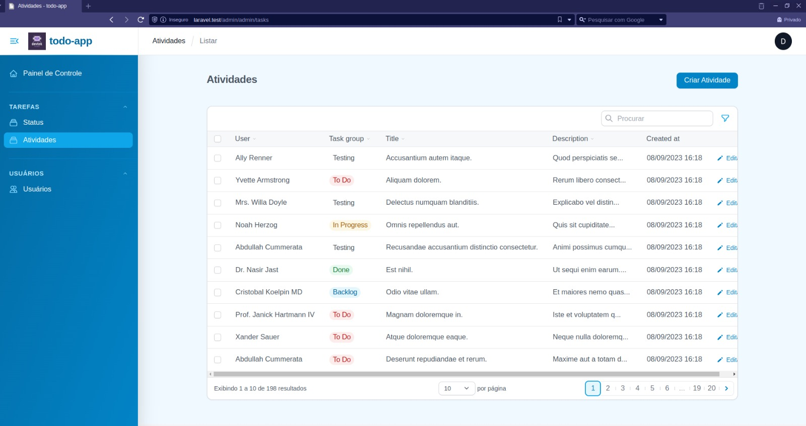

# To Do App

App de lista de tarefas

## Sobre o sistema

Controle de tarefas para acompanhar nossas atividades diárias que são cadastradas no sistema.
O sistema possui um filtro muito eficaz, podemos filtrar os usuários e/ou tarefas através de um filtro de busca digitando o nome ou tarefa do usuário e também podemos simplesmente filtrar clicando na lista de tarefas cadastradas e em andamento. Por exemplo:
Posso buscar as tarefas em andamento do usuário Fulano e terei o retorno de todas as tarefas deste usuário. Também posso filtrar só as tarefas concluídas deste usuário, deste modo posso saber quantas e quais tarefas temos de qualquer usuário cadastrado no meu sistema.
Através do nosso painel administrativo também posso conceder privilégios de administrador a qualquer usuário, apenas clicando em um botão toggle.
Todas as alterações feitas no meu painel são mostradas em tempo real na tela sem a necessidade de recarregá-la, o que torna nosso sistema bem mais fluído.

## Tecnologias utilizadas

- Laravel
- Livewire
- Docker
- Tailwind
- Linux
- MySql
- Filament

## Autores

@diegodevwebb

## :construction: *Projeto em andamento* :construction:

## Contribuições

Constribuições são sempre bem-vindas! Sinta-se à vontade para solicitar uma pull request.
